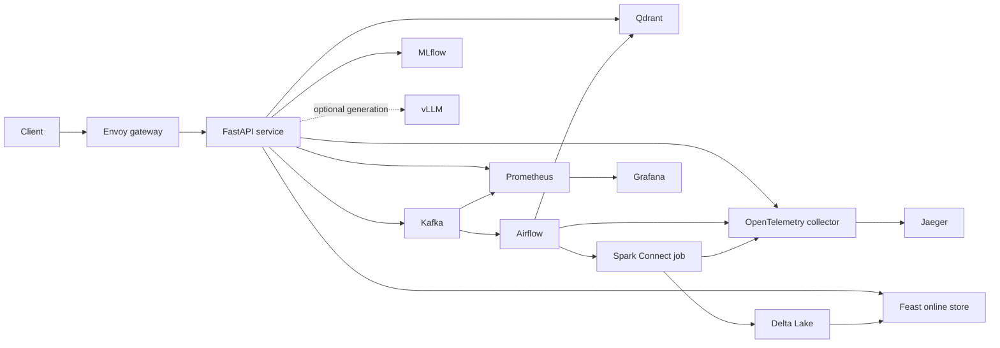

# Day 28 Track 2 — Answers

## Student information

- Name: Tran Thanh Binh
- Cohort: 4
- Student ID: 2A202601174

This is an individual submission. I own the implementation, validation, evidence collection, and explanation of the platform in this repository.

## Architecture and ownership

| Area | Ownership and responsibility |
|---|---|
| Contracts and ingestion | Versioned event contracts, request validation, Kafka headers, trace propagation, and idempotency keys |
| Data pipeline | Airflow orchestration, Spark processing, deterministic deduplication, Delta merge, and dead-letter recovery |
| Serving | Feast feature request construction, Qdrant retrieval, MLflow champion resolution, and readiness policy |
| Operations | Envoy rate limiting, OpenTelemetry traces, Prometheus metrics/alerts, Grafana provisioning, Docker Compose, and Kubernetes/GitOps manifests |
| Quality | Unit and live integration tests, portability checks, manifest validation, and evidence generation |

## Design trade-offs

### Contracts and Kafka

The repository keeps topic names, feature references, schema versions, and telemetry names in shared contracts. This reduces configuration drift, although a contract change has a larger coordination cost because producers, consumers, tests, and evidence rules must move together. Kafka preserves every delivery, while the event's idempotency key represents the logical operation. This gives an audit trail and at-least-once delivery without allowing retries to create multiple final rows.

### Deduplication and Delta Lake

For each idempotency key, the pipeline selects the greatest `(occurred_at, event_id)` tuple. The event ID is a deterministic tie-breaker when timestamps match, so replaying or reordering the same batch produces the same winner. Delta `MERGE` then updates one logical row instead of appending duplicates. This favors correctness and replay safety over the lower write cost of append-only storage.

### Feast

Feature requests use the canonical `FEATURE_REFS`, a single `asker_id` entity, and `full_feature_names=false`. Reusing the shared feature list avoids training/serving name drift. Feast is treated as an optional dependency in the readiness verdict: temporary feature-store loss degrades personalization but does not have to remove every API route from service.

### Qdrant and embeddings

Documents use deterministic point IDs so re-indexing is idempotent. The local multilingual sentence-transformer makes the lab reproducible without a paid embedding API, but it trades retrieval quality and throughput for portability. A production system should benchmark the embedding model on domain-specific relevance data, version the model and collection together, and use staged collection migration.

### MLflow release management

The serving contract resolves the MLflow `champion` alias instead of hard-coding a model version. Promotion and rollback therefore change an alias and retain model provenance. The trade-off is that the registry becomes a serving dependency, so production needs authentication, highly available artifact storage, caching, and a tested fallback to the last known-good release.

### Readiness and vLLM

Mandatory dependency failure returns `not_ready`; optional dependency failure returns `degraded`; otherwise the service is `ready`. This separates safe partial operation from unsafe serving. A real vLLM endpoint is intentionally not faked: when no GPU endpoint is supplied it is reported as unavailable or `UNVERIFIED`, preserving the integrity of the evidence.

### Gateway and observability

Envoy applies a token-bucket limit before traffic reaches the API. It protects the service cheaply, but a local bucket is not a globally consistent quota across replicas; production would use a shared rate-limit service and caller-specific policies. Trace context crosses HTTP and Kafka boundaries, while Prometheus provides aggregate signals. This combination improves incident diagnosis but adds telemetry cost, so sampling, retention, and label-cardinality limits are required at scale.

### Portability and deployment

Repository-relative paths and environment variables allow the same code to run from another checkout and keep host/container endpoints separate. Compose is suitable for a reproducible lab, while Kubernetes and GitOps manifests describe the production direction. The trade-off is extra configuration surfaces that must be validated together.

## Production gaps

- The Compose environment is single-host and contains single instances of Kafka, MLflow, Qdrant, Feast, Prometheus, and the orchestration services. It has no multi-zone availability or disaster-recovery test.
- Local volumes are convenient for the lab but are not a production backup strategy. Delta data and model artifacts need durable object storage, retention policies, versioned backups, and restore drills.
- The lab endpoints do not demonstrate complete production authentication, authorization, TLS/mTLS, network policy, secret rotation, or tenant isolation.
- Kafka needs production replication, partition sizing, retention planning, schema-compatibility enforcement, consumer-lag SLOs, and capacity testing.
- Delta merge concurrency, compaction, vacuum retention, late-data policy, and large-scale backfill behavior need load and failure testing.
- Feast needs a production online store, freshness monitoring, point-in-time-correct training validation, and a controlled materialization schedule.
- Qdrant needs replicas, snapshots, collection migration, relevance evaluation, and memory/capacity planning.
- MLflow needs an external database and artifact store, access controls, signed artifacts, approval policy, and recovery testing.
- Real GPU-backed vLLM performance and the credential-gated LangSmith path remain environment gates unless valid infrastructure is supplied; neither result should be simulated.
- The supplied Kubernetes/GitOps resources still require validation against the target cluster's ingress, storage classes, policies, autoscaling limits, and rollback process.
- Before production, run sustained load and soak tests, record P50/P95/P99 by route, set error-budget-based SLOs, and verify every alert has an actionable runbook.

## Individual contribution

I completed and validated the student-owned integration logic in `src/lab28_platform/integration_tasks.py`:

- generated byte-valued Kafka headers for idempotency and optional trace propagation;
- implemented deterministic latest-event deduplication by idempotency key;
- constructed the Feast online request from the canonical feature contract; and
- implemented mandatory-versus-optional dependency readiness semantics.

I also ran the repository's lint, contract-matrix, portability, manifest, unit, Compose, and live-service checks; initialized Kafka topics; indexed the Qdrant collection; registered the MLflow champion release; seeded the local platform; and collected only genuine runtime evidence. I did not fabricate results for unavailable GPU- or credential-gated services.

## Known environment notes

- On macOS, port 5000 may be occupied by AirPlay Receiver. The MLflow host port can be changed with `LAB28_MLFLOW_PORT=5001`, and host-side commands must then use `MLFLOW_TRACKING_URI=http://localhost:5001`.
- The non-GPU integration suite is a live system suite, not a unit suite. It requires the full Compose profile, including Airflow and Spark, plus initialized topics, documents, and a registered release.
- Model caches, `.env` files, credentials, runtime databases, weights, and `.lab28/` are local runtime state and must not be committed.
